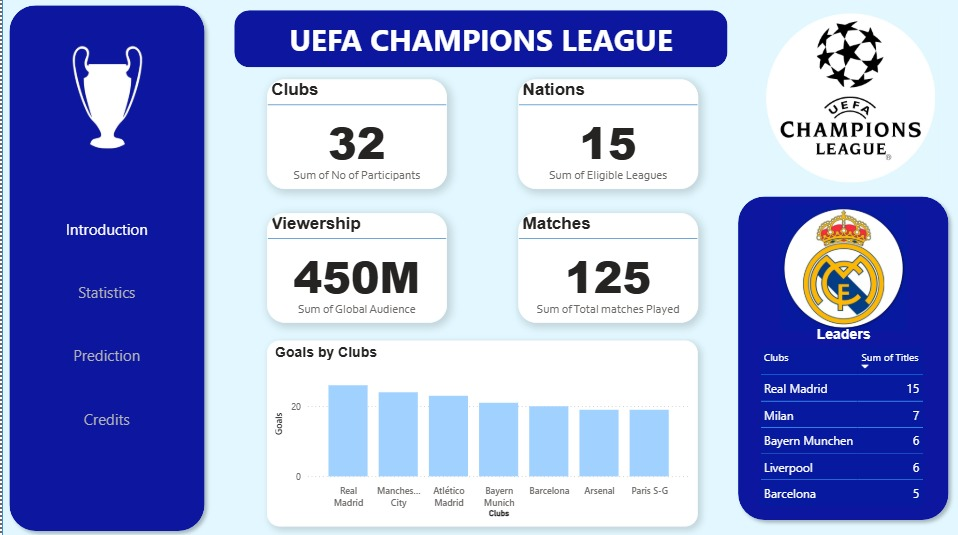
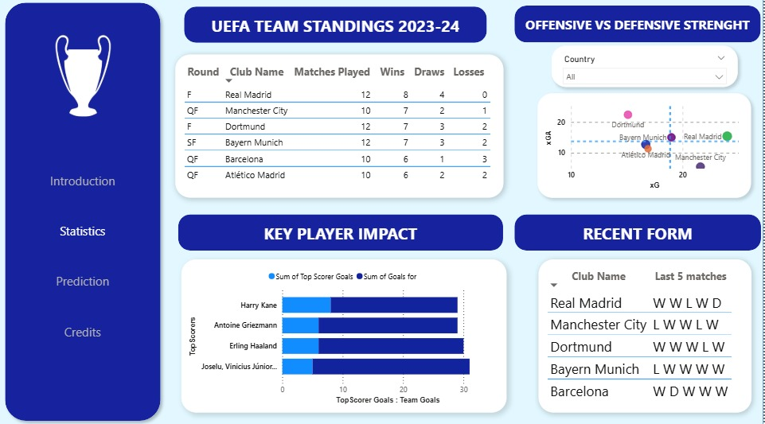
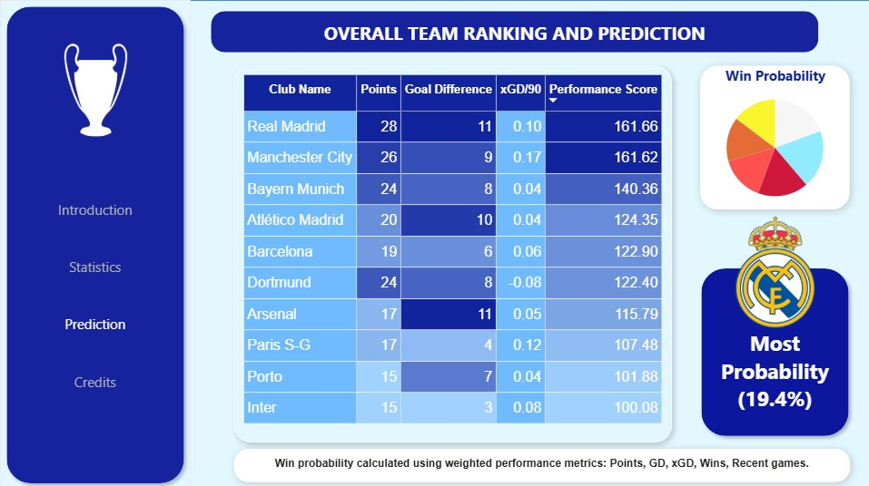

```markdown
# UEFA Champions League 2023-24 Analytics & Prediction Dashboard


An interactive, end-to-end business intelligence and data analytics dashboard built to track team performance metrics, player impacts, and match prediction modeling for the UEFA Champions League.

---

## Live Previews

### 1. Introduction Page
A comprehensive overview tracking global viewership, team participants, and historical UCL title leaders.


### 2. Team Standings & Advanced Metrics
An advanced analytics engine featuring rolling 5-match form strings and a custom scatter plot mapping Expected Goals ($xG$) against Expected Goals Against ($xGA$) to isolate underperforming vs. elite squad efficiency.


### 3. Predictive Modeling & Win Probabilities
A predictive dashboard that calculates and displays head-to-head win probabilities based on an advanced custom performance weighting algorithm.


---

## Repository Structure

The directory is mapped as follows:

```text
UEFA_Champions_League_Analytics_Dashboard/
├── assets/                 # Image components used for UI/UX design (logos, trophies)
│   ├── manchester_city_logo.png
│   ├── real_madrid_1.jpeg
│   ├── real_madrid_2.jpeg
│   ├── ucl_logo.jpeg
│   └── ucl_trophy.jpeg
├── data/                   # Raw datasets used for model ingestion and dashboard creation
│   ├── 23-24_season.csv
│   ├── card.csv
│   ├── madrid15.xlsx
│   └── winnersoty.csv
├── screenshots/            # Cleaned, finalized dashboard previews
│   ├── Introduction.jpeg
│   ├── Prediction.jpeg
│   └── Statistics.jpeg
├── video/                  # High-definition video presentation of the interactive features
│   └── Presentation.mp4
├── README.md               # Project documentation
└── UEFA_Champions_League_Analytics_Dashboard.pbix  # Master Power BI file

```

---

## Key Features & Statistical Architecture

* **Advanced Analytics Quadrant:** Combines $xG$ and $xGA$ metrics on a scatter plot to visually isolate overperforming and underperforming squads relative to structural chances created.
* **Predictive Performance Model:** A specialized calculation engine that scores teams and determines win probabilities using weighted metrics across historical points, Goal Difference (GD), $xGD/90$, total wins, and recent form.
* **Form & Impact Tracking:** Interactive components mapping individual player-specific goal contributions against raw team output alongside rolling 5-match tracking.

## Tech Stack & Skills Highlight

* **BI Tool:** Microsoft Power BI Desktop
* **Data Modeling:** Optimized table schemas and analytical data modeling.
* **DAX Formulas:** Advanced statistical weighting algorithms engineered via optimized variables (`VAR` / `RETURN`) and filter-safe calculations (`TOPN`).

---

## How to Run and View the Project

1. Clone this repository or download the master `UEFA_Champions_League_Analytics_Dashboard.pbix` file.
2. Download your demo overview directly from the `video/Presentation.mp4` file for a fast interactive preview.
3. Open the `.pbix` file locally using Power BI Desktop to natively interact with the custom country slicers, tables, and visualization elements.

---

## Author

**Aamir Khan** *Data Science & Analytics* [](https://www.linkedin.com/in/aamir-khan-94498b284/)

```